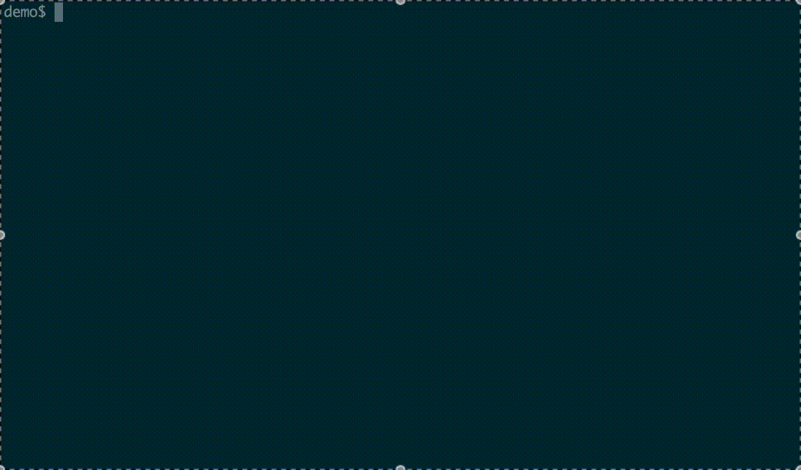

# ggc
[](https://github.com/bmf-san/ggc/releases)
[](https://goreportcard.com/report/github.com/bmf-san/ggc)
[](https://codecov.io/gh/bmf-san/ggc)
[](https://github.com/bmf-san/ggc/blob/main/LICENSE)
[](https://pkg.go.dev/github.com/bmf-san/ggc)
[](https://sourcegraph.com/github.com/bmf-san/ggc?badge)


A Go Git CLI.


This logo was created by [gopherize.me](https://gopherize.me/gopher/d654ddf2b81c2b4123684f93071af0cf559eb0b5).

## Demo



## Overview

ggc is a Git tool written in Go, offering both traditional CLI commands and an interactive interface with incremental search. You can either run subcommands like ggc add directly, or launch the interactive mode by simply typing ggc. Designed to be fast, user-friendly, and extensible.

## Features

- Traditional command-line interface (CLI): Run ggc <command> [args] to execute specific operations directly.
- Interactive interface: Run ggc with no arguments to launch an incremental search UI for command selection.
- Simple commands for common Git operations (add, push, pull, branch, log, etc.)
- Composite commands that combine multiple Git operations
- Interactive UI for branch/file selection and message input
- Implemented using the Go standard library and:
    - [golang.org/x/term](https://pkg.go.dev/golang.org/x/term) – for terminal interaction
    - [golang.org/x/sys](https://pkg.go.dev/golang.org/x/sys) – for low-level OS interaction
    - [gopkg.in/yaml.v3](https://pkg.go.dev/gopkg.in/yaml.v3) – for parsing `~/.ggcconfig.yaml`

## Supported Environments
- OS: macOS (Apple Silicon/Intel) - Verified
- Go version: 1.24 or later recommended
- Dependencies: Go standard library, `golang.org/x/term`, `golang.org/x/sys`, `gopkg.in/yaml.v3`
- Requirement: `git` command must be installed

## Installation

### Pre-compiled Binaries (Recommended)

Pre-compiled binaries are available for multiple platforms and architectures. This is the fastest way to get started with `ggc`.

#### Download from Releases
Visit the [Releases](https://github.com/bmf-san/ggc/releases/) page to download the latest binary for your platform:

#### Supported Platforms:

- macOS: `darwin_amd64` (Intel), `darwin_arm64` (Apple Silicon)
- Linux: `linux_amd64`, `linux_arm64`
- Windows: `windows_amd64`

### Quick Install with Script

The easiest way to install `ggc` is using the provided installation script:

```sh
# Download and run the installation script
curl -sSL https://raw.githubusercontent.com/bmf-san/ggc/main/install.sh | bash
```

Or download and run it manually:

```sh
# Download the script
curl -O https://raw.githubusercontent.com/bmf-san/ggc/main/install.sh

# Make it executable
chmod +x install.sh

# Run the script
./install.sh
```

The script will:
- Detect your operating system and architecture
- Download the appropriate binary for your system
- Install using `git`, manual `go install` fallback
- Verify the installation

### Build with make

```sh
git clone <repository URL>
make build
```

Place the `ggc` binary in a directory included in your PATH.

### Development Setup

For development, you can use the Makefile to install required tools and dependencies:

```sh
# Install all dependencies and tools
make deps

# Run formatter
make fmt

# Run tests
make test

# Run linter
make lint

# Run tests with coverage
make cover

# Run tests and lint
make test-and-lint

# Build with go build
make build

# Build and run with version info
make run
```

The Makefile will automatically install required tools like `golangci-lint` using `go install`.

### Global install with go install

```sh
go install github.com/bmf-san/ggc@latest
```

- The `ggc` binary will be installed to `$GOBIN` (usually `$HOME/go/bin`).
- If `$GOBIN` is in your `PATH`, you can use `ggc` from anywhere.
- If not, add it to your `PATH`:

> [!NOTE]
> When using `go install`, you may get limited version info due to `ldflags` not working with `go install`. It is recommended to build with make build or use the install script or binaries.

```sh
export PATH=$PATH:$(go env GOBIN)
# or
export PATH=$PATH:$HOME/go/bin
```

## Usage

### Interactive Command Selection (Incremental Search UI)

Just run:

```sh
ggc
```

- Type to filter commands (incremental search)
- Use ctrl+n/ctrl+p to move selection, Enter to execute
- If a command requires arguments (e.g. `<file>`, `<name>`, `<url>`), you will be prompted for input (always left-aligned)
- After command execution, results are displayed and you can press Enter to continue
- After viewing results, you return to the command selection screen for continuous use
- Use "quit" command or ctrl+c to exit interactive mode
- All UI and prompts are in English

### Available Commands

| Command | Description |
|--------|-------------|
| `add <file>` | Add specific file to the index |
| `add .` | Add all changes |
| `add -p` | Add changes interactively |
| `branch current` | Show current branch |
| `branch checkout` | Checkout existing branch |
| `branch checkout-remote` | Checkout remote branch |
| `branch create` | Create and checkout new branch |
| `branch delete` | Delete a branch |
| `branch delete-merged` | Delete merged branches |
| `branch list-local` | List local branches |
| `branch list-remote` | List remote branches |
| `clean files` | Clean untracked files |
| `clean dirs` | Clean untracked directories |
| `commit` | Commit staged changes |
| `commit amend <message>` | Amend previous commit |
| `commit amend --no-edit` | Amend without editing message |
| `commit allow-empty` | Create an empty commit |
| `commit tmp` | Create temporary commit |
| `diff staged` | Show staged changes |
| `diff unstaged` | Show unstaged changes |
| `fetch --prune` | Fetch and prune remotes |
| `log simple` | Show commit logs in simple format |
| `log graph` | Show commit logs with a graph |
| `pull current` | Pull current branch |
| `pull rebase` | Pull with rebase |
| `push current` | Push current branch |
| `push force` | Force push current branch |
| `rebase` | Rebase current branch |
| `remote list` | List remotes |
| `remote add <name> <url>` | Add a new remote |
| `remote remove <name>` | Remove a remote |
| `remote set-url <name> <url>` | Change remote URL |
| `config list` | List config variables |
| `config get <key>` | Get value for config key |
| `config set <key> <value>` | Set config key and value |
| `hook list` | List all hooks |
| `hook install <hook>` | Install a hook |
| `hook enable <hook>` | Enable a hook |
| `hook disable <hook>` | Disable a hook |
| `hook uninstall <hook>` | Remove a hook |
| `hook edit <hook>` | Edit a hook |
| `tag list` | List all tags |
| `tag create <v>` | Create a tag |
| `tag annotated <v> <msg>` | Create annotated tag |
| `tag delete <v>` | Delete a tag |
| `tag push` | Push all tags |
| `tag push <v>` | Push specific tag |
| `tag show <v>` | Show tag details |
| `stash` | Stash current changes |
| `stash pop` | Apply and remove latest stash |
| `stash drop` | Remove latest stash |
| `status short` | Show concise status |
| `version` | Show current ggc version |

## Directory Structure

```
main.go                  # Entry point
router/                  # Command routing logic
cmd/                     # Command entry handlers
git/                     # Git operation wrappers
```

## Shell Completion

### Bash
Add the following to your `~/.bash_profile` or `~/.bashrc`:
```bash
if [ -f "$(go env GOPATH)/pkg/mod/github.com/bmf-san/ggc@*/tools/completions/ggc.bash" ]; then
  . "$(go env GOPATH)"/pkg/mod/github.com/bmf-san/ggc@*/tools/completions/ggc.bash
fi
```

### Zsh
Add the following to your `~/.zshrc`:
```zsh
if [ -f "$(go env GOPATH)/pkg/mod/github.com/bmf-san/ggc@*/tools/completions/ggc.bash" ]; then
  . "$(go env GOPATH)"/pkg/mod/github.com/bmf-san/ggc@*/tools/completions/ggc.bash
fi
```

### Fish
Add the following to your `~/.config/fish/config.fish`:
```fish
if test -f (go env GOPATH)/pkg/mod/github.com/bmf-san/ggc@*/tools/completions/ggc.fish
    source (go env GOPATH)/pkg/mod/github.com/bmf-san/ggc@*/tools/completions/ggc.fish
end
```

This setup will automatically find the completion script regardless of the installed version.

# Contributing

See [CONTRIBUTING.md](CONTRIBUTING.md) and [CODE_OF_CONDUCT.md](CODE_OF_CONDUCT.md) for details.

# Sponsor

If you’d like to support my work, please consider sponsoring me!

[GitHub Sponsors – bmf-san](https://github.com/sponsors/bmf-san)

Or simply giving ⭐ on GitHub is greatly appreciated—it keeps me motivated to maintain and improve the project! :D

# Stargazers
[](https://github.com/bmf-san/ggc/stargazers)

# Forkers
[](https://github.com/bmf-san/ggc/network/members)

## License

This project is licensed under the MIT License - see the [LICENSE.md](LICENSE.md) file for details.
