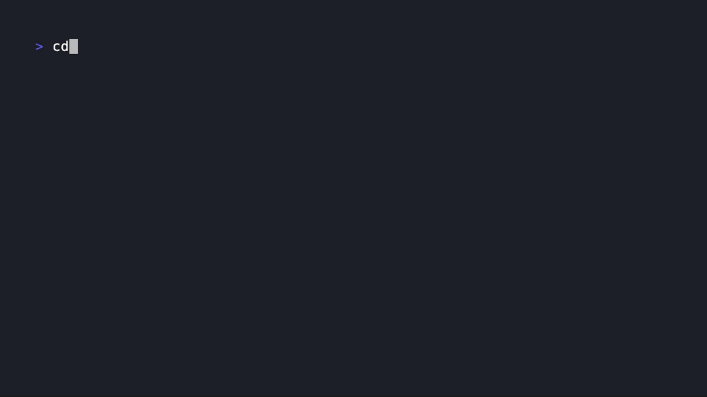
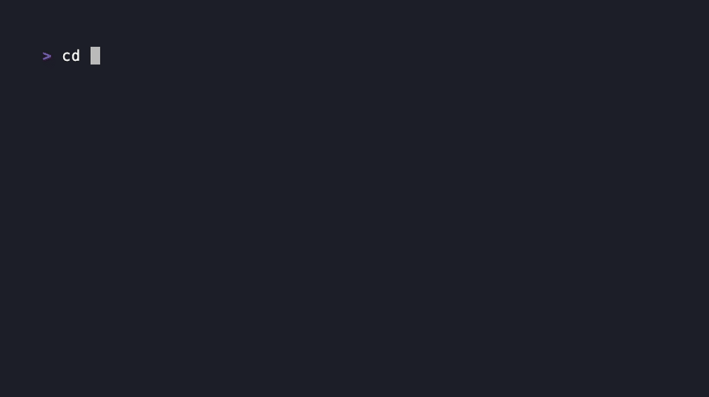

# ggc
[](https://github.com/bmf-san/ggc/releases)
[](https://goreportcard.com/report/github.com/bmf-san/ggc)
[](https://codecov.io/gh/bmf-san/ggc)
[](https://github.com/bmf-san/ggc/blob/main/LICENSE)
[](https://pkg.go.dev/github.com/bmf-san/ggc)
[](https://sourcegraph.com/github.com/bmf-san/ggc?badge)
[](https://github.com/bmf-san/ggc/actions/workflows/ci.yml)
[](https://github.com/bmf-san/ggc/actions/workflows/github-code-scanning/codeql)
[](https://github.com/bmf-san/ggc/actions/workflows/dependabot/dependabot-updates)


A Go Git CLI.


This logo was created by [gopherize.me](https://gopherize.me/gopher/d654ddf2b81c2b4123684f93071af0cf559eb0b5).

## Demo

| Branch Management | CLI Workflow | Interactive Overview |
| --- | --- | --- |
|  |  |  |

## Overview

ggc is a Git tool written in Go, offering both traditional CLI commands and an interactive interface with incremental search. You can either run subcommands like ggc add directly, or launch the interactive mode by simply typing ggc. Designed to be fast, user-friendly, and extensible.

## Features

- Traditional command-line interface (CLI): Run ggc <command> [args] to execute specific operations directly.
- Interactive interface: Run ggc with no arguments to launch an incremental search UI for command selection.
- **Workflow functionality**: Build and execute multi-command workflows in interactive mode (e.g., add → commit → push)
- Simple commands for common Git operations (add, push, pull, branch, log, etc.)
- Composite commands that combine multiple Git operations
- Interactive UI for branch/file selection and message input
- Customizable keybindings with profile support (default, emacs, vi, readline)
- Command aliases for chaining multiple operations
- Unified, flagless command syntax for intuitive usage
- Shell completion for Bash, Zsh, and Fish
- Configurable via YAML configuration file
- Built with Go standard library and minimal dependencies

## Supported Environments

### Supported Platforms
- macOS (Apple Silicon/Intel): `darwin_amd64`, `darwin_arm64` - Verified
- Linux (ARM64/x86_64): `linux_amd64`, `linux_arm64` - Supported
- Windows (x86_64): `windows_amd64` - Supported

### Requirements
- Go version: 1.25 or later recommended
- `git` command must be installed

## Installation

### Pre-compiled Binaries (Recommended)

Pre-compiled binaries are available for multiple platforms and architectures. This is the fastest way to get started with `ggc`.

#### Download from Releases
1. Visit the [Releases](https://github.com/bmf-san/ggc/releases/) page to download the latest binary for your platform
2. Make the binary executable: `chmod +x ggc`
3. Move it to a directory in your PATH: `sudo mv ggc /usr/local/bin/` (or another location in your PATH)
4. Verify installation: `ggc version`

### Homebrew

Install via Homebrew:

```sh
brew install ggc
# Upgrade later:
# brew upgrade ggc
# Verify:
# ggc version
```

- Formula: https://formulae.brew.sh/formula/ggc
- Supported platforms via Homebrew: macOS (Apple Silicon/Intel), Linux (ARM64/x86_64)

### Quick Install with Script

The easiest way to install `ggc` is using the provided installation script:

```sh
# Download and run the installation script
curl -sSL https://raw.githubusercontent.com/bmf-san/ggc/main/install.sh | bash
```

Or download and run it manually:

```sh
# Download the script
curl -O https://raw.githubusercontent.com/bmf-san/ggc/main/install.sh

# Make it executable
chmod +x install.sh

# Run the script
./install.sh
```

The script will:
- Detect your operating system and architecture
- Download the appropriate binary for your system
- Install using `git`, manual `go install` fallback
- Verify the installation

### Build with make

```sh
# Clone the repository by SSH
git clone git@github.com:bmf-san/ggc.git
cd ggc

# Build the binary
make build

# Move the binary to a directory in your PATH
sudo mv ggc /usr/local/bin/
```

### Development Setup

#### Prerequisites for development
- Go 1.25 or later
- Git

For development, you can use the Makefile to install required tools and dependencies:

```sh
# Install all dependencies and tools
make deps

# Run formatter
make fmt

# Run tests
make test

# Run linter
make lint

# Run tests with coverage
make cover

# Run tests and lint
make test-and-lint

# Build with go build
make build

# Build and run with version info
make run
```

The Makefile will automatically install required tools like `golangci-lint` using `go install`.

### Global install with go install

```sh
# Requires Go 1.25+ installed
go install github.com/bmf-san/ggc/v7@latest
```

- The `ggc` binary will be installed to `$GOBIN` (usually `$HOME/go/bin`).
- If `$GOBIN` is in your `PATH`, you can use `ggc` from anywhere.
- If not, add it to your `PATH`:

> [!NOTE]
> When using `go install`, you may get limited version info due to `ldflags` not working with `go install`. It is recommended to build with make build or use the install script or binaries.

```sh
export PATH=$PATH:$(go env GOBIN)
# or
export PATH=$PATH:$HOME/go/bin
```

## Usage

### Interactive Command Selection (Fuzzy Search UI)

Just run:

```sh
ggc
```

**Search Features:**
- **Fuzzy matching**: Type any characters that appear in the command (e.g., `"bd"` matches `"branch delete"`, `"ca"` matches `"commit amend"`)
- **Case-insensitive**: Search works regardless of case
- **Real-time filtering**: Results update as you type

**Navigation & Editing:**
- `Ctrl+n` / `Ctrl+p`: Navigate up/down through results
- `←` / `→`: Move cursor left/right
- `Ctrl+←` / `Ctrl+→`: Move by word
- `Option+←` / `Option+→` (macOS): Move by word
- `Ctrl+a` / `Ctrl+e`: Move cursor to beginning/end of input
- `Ctrl+u`: Clear all input
- `Ctrl+w`: Delete word before cursor
- `Option+Backspace` (macOS): Delete word before cursor
- `Ctrl+k`: Delete from cursor to end of line
- `Backspace`: Delete character before cursor
- `Enter`: Execute selected command
- `Ctrl+c`: Exit interactive mode

**Workflow Operations:**
- `Tab`: Choose which workflow receives the selected command
- `Enter`: Confirm the selection overlay or execute the highlighted workflow
- `Esc`: Dismiss the selection overlay or exit workflow view
- `Ctrl+n`: Create a new workflow (in workflow view)
- `d`: Delete the selected workflow (in workflow view)
- `Ctrl+t`: Toggle the workflow management view

**Command Execution:**
- If a command requires arguments (e.g. `<file>`, `<name>`, `<url>`), you will be prompted for input
- After command execution, results are displayed and you can press Enter to continue
- After viewing results, you return to the command selection screen for continuous use
- Type `"quit"` or use `Ctrl+c` to exit interactive mode
- All UI and prompts are in English

**Workflow Feature:**
- Build and manage multiple workflows in parallel
- Use the selection overlay (`Tab`) to choose a target workflow per command
- Placeholder arguments (e.g., `<message>`) are prompted during workflow execution
- Workflows persist after execution for reuse or further editing
- Common workflow examples: `add` → `commit` → `push`, `fetch` → `rebase` → `push force`

**Examples of Fuzzy Search:**
- `"bd"` → finds `"branch delete"`
- `"ca"` → finds `"commit amend"`
- `"ai"` → finds `"add interactive"`
- `"ss"` → finds `"status short"`
- `"brdel"` → finds `"branch delete"`

### Available Commands

| Command | Description |
|--------|-------------|
| `add .` | Add all changes to the index |
| `add <file>` | Add a specific file to the index |
| `add interactive` | Add changes interactively |
| `add patch` | Add changes interactively (patch mode) |
| `help` | Show main help message |
| `help <command>` | Show help for a specific command |
| `branch checkout` | Switch to an existing branch |
| `branch checkout remote` | Create and checkout a local branch from the remote |
| `branch contains <commit>` | Show branches containing a commit |
| `branch create` | Create and checkout a new branch |
| `branch current` | Show current branch name |
| `branch delete` | Delete local branch |
| `branch delete merged` | Delete local merged branch |
| `branch info <branch>` | Show detailed branch information |
| `branch list local` | List local branches |
| `branch list remote` | List remote branches |
| `branch list verbose` | Show detailed branch listing |
| `branch move <branch> <commit>` | Move branch to specified commit |
| `branch rename <old> <new>` | Rename a branch |
| `branch set upstream <branch> <upstream>` | Set upstream for a branch |
| `branch sort [date|name]` | List branches sorted by date or name |
| `commit <message>` | Create commit with a message |
| `commit allow empty` | Create an empty commit |
| `commit amend` | Amend previous commit (editor) |
| `commit amend no-edit` | Amend without editing commit message |
| `log graph` | Show log with graph |
| `log simple` | Show simple historical log |
| `fetch` | Fetch from the remote |
| `fetch prune` | Fetch and clean stale references |
| `pull current` | Pull current branch from remote repository |
| `pull rebase` | Pull and rebase |
| `push current` | Push current branch to remote repository |
| `push force` | Force push current branch |
| `remote add <name> <url>` | Add remote repository |
| `remote list` | List all remote repositories |
| `remote remove <name>` | Remove remote repository |
| `remote set-url <name> <url>` | Change remote URL |
| `status` | Show working tree status |
| `status short` | Show concise status (porcelain format) |
| `clean dirs` | Clean untracked directories |
| `clean files` | Clean untracked files |
| `clean interactive` | Clean files interactively |
| `restore .` | Restore all files in working directory from index |
| `restore <commit> <file>` | Restore file from specific commit |
| `restore <file>` | Restore file in working directory from index |
| `restore staged .` | Unstage all files |
| `restore staged <file>` | Unstage file (restore from HEAD to index) |
| `diff` | Show changes (git diff HEAD) |
| `diff head` | Alias for default diff against HEAD |
| `diff staged` | Show staged changes |
| `diff unstaged` | Show unstaged changes |
| `tag annotated <tag> <message>` | Create annotated tag |
| `tag create <tag>` | Create tag |
| `tag delete <tag>` | Delete tag |
| `tag list` | List all tags |
| `tag push` | Push tags to remote |
| `tag show <tag>` | Show tag information |
| `config get <key>` | Get a specific config value |
| `config list` | List all configuration |
| `config set <key> <value>` | Set a configuration value |
| `hook disable <hook>` | Disable a hook |
| `hook edit <hook>` | Edit a hook's contents |
| `hook enable <hook>` | Enable a hook |
| `hook install <hook>` | Install a hook |
| `hook list` | List all hooks |
| `hook uninstall <hook>` | Uninstall an existing hook |
| `rebase <upstream>` | Rebase current branch onto <upstream> |
| `rebase abort` | Abort an in-progress rebase |
| `rebase continue` | Continue an in-progress rebase |
| `rebase interactive` | Interactive rebase |
| `rebase skip` | Skip current patch and continue |
| `stash` | Stash current changes |
| `stash apply` | Apply stash without removing it |
| `stash apply <stash>` | Apply specific stash without removing it |
| `stash branch <branch>` | Create branch from stash |
| `stash branch <branch> <stash>` | Create branch from specific stash |
| `stash clear` | Remove all stashes |
| `stash create` | Create stash and return object name |
| `stash drop` | Remove the latest stash |
| `stash drop <stash>` | Remove specific stash |
| `stash list` | List all stashes |
| `stash pop` | Apply and remove the latest stash |
| `stash pop <stash>` | Apply and remove specific stash |
| `stash push` | Save changes to new stash |
| `stash push -m <message>` | Save changes to new stash with message |
| `stash save <message>` | Save changes to new stash with message |
| `stash show` | Show changes in stash |
| `stash show <stash>` | Show changes in specific stash |
| `stash store <object>` | Store stash object |
| `debug-keys` | Show current keybindings |
| `debug-keys raw` | Capture key sequences interactively |
| `debug-keys raw <file>` | Capture key sequences and save them to a file |
| `quit` | Exit interactive mode |
| `version` | Display current ggc version |
### Unified Syntax and "--" Separator

- Unified commands: ggc uses a flagless, space-separated syntax (no `-x`/`--long` options). Use subcommands and words, e.g., `ggc fetch prune`, `ggc commit allow empty`.
- Passing literals that begin with `-`: use the standard `--` separator to mark the end of options; everything after `--` is treated as data.
  - Example: `ggc commit -- - fix leading dash`
- When `--` is encountered, all subsequent arguments are treated as data, not as commands or options.
- This unified syntax makes the CLI behavior predictable, safe, and testable.

## Command Aliases

Chain multiple `ggc` commands together with custom aliases you define. Here is an example of aliases in your `~/.ggcconfig.yaml` file:
```yaml
aliases:
    ac:
        - add .
        - commit tmp
    br: branch
    ci: commit
    quick:
        - status
        - add .
        - commit
    st: status
    sync:
        - pull current
        - add .
        - commit
        - push current
```

Aliases support two formats:

1. **Simple alias**: Maps to a single command (e.g., `br: branch`)
   - Arguments are passed to the aliased command
   - Example: `ggc br list` will execute `ggc branch list`

2. **Sequence alias**: Maps to multiple commands in sequence (e.g., `ac: [add ., commit tmp]`)
   - Commands are executed in order
   - Arguments are ignored for sequence aliases
   - Example: Running `ggc ac` will execute first `ggc add .` then `ggc commit tmp` and terminate

Any arguments passed to sequence aliases are ignored - this is by design.

## Interactive Mode Keybindings

You can customize keybindings in the interactive mode by adding configuration to your `~/.ggcconfig.yaml` file:

### Basic Configuration

```yaml
interactive:
  profile: default  # Base profile to extend (default, emacs, vi, readline)
  keybindings:      # Global keybindings
    move_up: "ctrl+p"
    move_down: "ctrl+n"
    move_to_beginning: "ctrl+a"
    move_to_end: "ctrl+e"
    delete_word: "ctrl+w"
    clear_line: "ctrl+u"
    delete_to_end: "ctrl+k"
    # Workflow keybindings
    add_to_workflow: "tab"
    toggle_workflow_view: "ctrl+t"
    clear_workflow: "c"
    soft_cancel: "ctrl+g"
```

### Supported Key Format Notations

ggc supports three key binding format notations:
- `ctrl+key` format: e.g., `ctrl+w`, `ctrl+a`
- Caret notation: e.g., `^w`, `^a`
- Emacs notation: e.g., `C-w`, `C-a`

These notations are interchangeable - use whichever style you prefer.

### Advanced Configuration

#### Profiles and Layers

ggc provides four built-in keybinding profiles:

- **default**: Current default behavior (backward compatible)
- **emacs**: Emacs-style bindings (Ctrl-based, modeless)
- **vi**: Vi-style bindings (modal concepts adapted for CLI)
- **readline**: GNU Readline standard bindings

Configuration resolution order: defaults → profile → platform (OS) → terminal ($TERM) → your config.

When conflicts occur, later layers override earlier ones. For example, your custom settings in `~/.ggcconfig.yaml` will override any default profile settings.

#### Default Profile Bindings

Each profile has different default keybindings:

- **default**: Standard terminal navigation (arrow keys for movement)
- **emacs**: Emacs-style commands (Ctrl+P/N for up/down, Ctrl+A/E for start/end)
- **vi**: Vi-inspired navigation (H/J/K/L, 0/$ for start/end)
- **readline**: GNU Readline compatible (similar to Emacs but with some differences)

#### Available Contexts

You can define keybindings for specific UI contexts:

- **global**: Always active (reserved keys like Ctrl+C and soft cancel via Ctrl+G/Esc)
- **input**: When typing/editing the search query
- **results**: When navigating through filtered results
- **search**: When fuzzy search is active (combines input + results)

Soft cancel lets you abandon the current interactive operation and return to the search screen without leaving interactive mode. Press `Ctrl+G` (or `Esc` when no escape sequence follows) to trigger a soft cancel; `Ctrl+C` continues to provide a hard exit.

#### Per-OS Configuration

Configure different key bindings for each operating system:

```yaml
interactive:
  # OS-specific overrides
  darwin:    # macOS
    keybindings:
      move_up: "up"
      move_down: "down"

  linux:     # Linux
    keybindings:
      move_up: "up"
      move_down: "down"

  windows:   # Windows
    keybindings:
      move_up: "up"
      move_down: "down"
```

#### Context-Specific Configuration

Configure key bindings for different operational contexts:

```yaml
interactive:
  contexts:
    # Input field bindings
    input:
      keybindings:
        delete_word: ["ctrl+w", "alt+backspace"]  # Multiple bindings

    # Results list bindings
    results:
      keybindings:
        move_up: ["up", "ctrl+p"]
        move_down: ["down", "ctrl+n"]
```

#### Terminal-Specific Configuration

Target specific terminals via `$TERM` value:

```yaml
interactive:
  terminals:
    xterm-256color:
      keybindings:
        delete_to_end: "ctrl+k"
      contexts:
        input:
          keybindings:
            move_to_beginning: "ctrl+a"
```

#### Common Keybinding Names

Here are some common keybinding action names you can customize:

- **Navigation**: `move_up`, `move_down`, `move_left`, `move_right`
- **Editing**: `delete_word`, `clear_line`, `delete_to_end`
- **Cursor Movement**: `move_to_beginning`, `move_to_end`, `move_word_left`, `move_word_right`
- **Control**: `execute`, `cancel`, `quit`
- **Workflow**: `add_to_workflow`, `toggle_workflow_view`, `clear_workflow`

#### Special Key Support

- **Alt/Option Keys**: In macOS terminals, configure to send ESC+<letter> for Option keys. In iTerm2, set "Left/Right Option Key" to "Esc+".
- **Function Keys and Alt/Meta Keys**: Support for these keys is limited in the current implementation.
- **Multiple Bindings**: You can assign multiple key combinations to the same action using array syntax.

### Managing Configuration

Check your current key binding settings:

```sh
# Display all settings
ggc config list

# Check key binding settings
ggc config get interactive.keybindings

# Check OS-specific settings
ggc config get interactive.darwin
```

```sh
# Check OS-specific keybinding settings
ggc config get interactive.darwin.keybindings

# Set a specific binding
ggc config set interactive.keybindings.move_up "ctrl+p"
```

### tmux Support

If using tmux, add the following to your `.tmux.conf` to improve key input processing:

```
set -g xterm-keys on
```

## Directory Structure

```
main.go                  # Entry point
main_test.go             # Main package tests
cmd/                     # Command entry handlers
config/                  # Configuration management
docs/                    # Documentation and assets
git/                     # Git operation wrappers
internal/                # Internal packages
  testutil/              # Test utilities
router/                  # Command routing logic
test/                    # BATS integration tests
tools/                   # Development and build tools
  completions/           # Shell completion scripts
```

## Shell Completion

ggc provides tab completion for commands and subcommands in Bash, Zsh, and Fish shells.

### Generating Completion Scripts

Run `make docs` (or `make completions`) to regenerate the README command table and the shell completion scripts in `tools/completions/` from the centralized command registry. This keeps documentation and completions aligned with the current command surface.

### Using Pre-Built Completion Scripts

ggc comes with pre-built completion scripts for common shells located in the `tools/completions` directory.

### Enabling Completions

#### Bash
Add the following to your `~/.bash_profile` or `~/.bashrc`:
```bash
# Option 1: Use the pre-installed completion script (if installed via go install)
if [ -f "$(go env GOPATH)/pkg/mod/github.com/bmf-san/ggc/v7@*/tools/completions/ggc.bash" ]; then
  . "$(go env GOPATH)"/pkg/mod/github.com/bmf-san/ggc/v7@*/tools/completions/ggc.bash
fi

# Option 2: Use the generated completion script
if [ -f ~/.ggc-completion.bash ]; then
  . ~/.ggc-completion.bash
fi
```

#### Zsh
Add the following to your `~/.zshrc`:
```zsh
# Option 1: Use the pre-installed completion script (if installed via go install)
if [ -f "$(go env GOPATH)/pkg/mod/github.com/bmf-san/ggc/v7@*/tools/completions/ggc.zsh" ]; then
  . "$(go env GOPATH)"/pkg/mod/github.com/bmf-san/ggc/v7@*/tools/completions/ggc.zsh
fi

# Option 2: Use the generated completion script
if [ -f ~/.ggc-completion.zsh ]; then
  . ~/.ggc-completion.zsh
fi
```

#### Fish
Add the following to your `~/.config/fish/config.fish`:
```fish
# Option 1: Use the pre-installed completion script (if installed via go install)
if test -f (go env GOPATH)/pkg/mod/github.com/bmf-san/ggc/v7@*/tools/completions/ggc.fish
    source (go env GOPATH)/pkg/mod/github.com/bmf-san/ggc/v7@*/tools/completions/ggc.fish
end

# Option 2: Use the generated completion script
if test -f ~/.ggc-completion.fish
    source ~/.ggc-completion.fish
end
```

### Using Completions

Once enabled, tab completion will work for all ggc commands and subcommands. For example:

```
$ ggc b<tab>          # Completes to "branch"
$ ggc branch <tab>    # Shows branch subcommands (checkout, list, etc.)
$ ggc checkout <tab>  # Shows available local branches
```

Commands with multiple levels of subcommands are also supported:
```
$ ggc branch delete m<tab>   # Completes matching branch names
$ ggc commit amend <tab>     # Shows "no-edit" option
```

This setup will automatically find the completion script regardless of the installed version.

# References

- [Git Documentation](https://git-scm.com/docs) - Complete Git reference documentation
- [Git Tutorial](https://git-scm.com/docs/gittutorial) - Official Git tutorial for beginners
- [Git User Manual](https://git-scm.com/docs/user-manual) - Comprehensive Git user guide

# Contributing

See [CONTRIBUTING.md](CONTRIBUTING.md) and [CODE_OF_CONDUCT.md](CODE_OF_CONDUCT.md) for details.

# Sponsor

If you’d like to support my work, please consider sponsoring me!

[GitHub Sponsors – bmf-san](https://github.com/sponsors/bmf-san)

Or simply giving ⭐ on GitHub is greatly appreciated—it keeps me motivated to maintain and improve the project! :D

# Stargazers
[](https://github.com/bmf-san/ggc/stargazers)

# Forkers
[](https://github.com/bmf-san/ggc/network/members)

## License

This project is licensed under the MIT License - see the [LICENSE.md](LICENSE.md) file for details.
