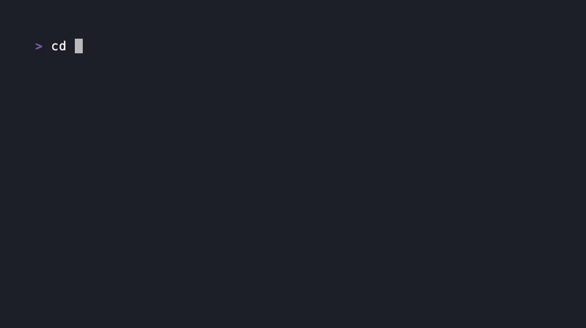
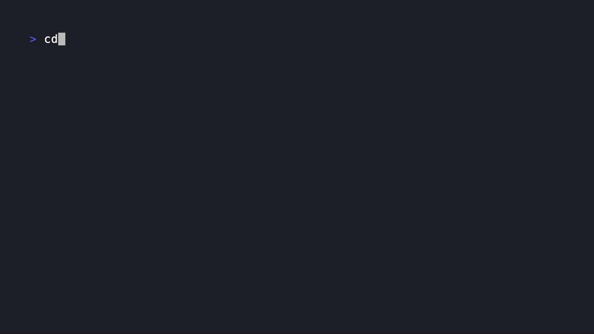

# ggc
[](https://github.com/bmf-san/ggc/releases)
[](https://goreportcard.com/report/github.com/bmf-san/ggc)
[](https://codecov.io/gh/bmf-san/ggc)
[](https://github.com/bmf-san/ggc/blob/main/LICENSE)
[](https://pkg.go.dev/github.com/bmf-san/ggc)
[](https://sourcegraph.com/github.com/bmf-san/ggc?badge)
[](https://github.com/bmf-san/ggc/actions/workflows/ci.yml)
[](https://github.com/bmf-san/ggc/actions/workflows/github-code-scanning/codeql)
[](https://github.com/bmf-san/ggc/actions/workflows/dependabot/dependabot-updates)
[](https://github.com/avelino/awesome-go)


A Go Git CLI.

📖 **Full documentation:** https://bmf-san.github.io/ggc/


This logo was created by [gopherize.me](https://gopherize.me/gopher/d654ddf2b81c2b4123684f93071af0cf559eb0b5).

## Demo

Click any GIF to view full size.

| Interactive & Workflow mode | CLI workflow | Branch management |
| --- | --- | --- |
| [](docs/demos/generated/interactive-overview.gif) | [](docs/demos/generated/cli-workflow.gif) | [](docs/demos/generated/branch-management.gif) |
| Fuzzy-search every `ggc` command, then press <kbd>Tab</kbd> to queue them into a workflow and <kbd>Ctrl</kbd>+<kbd>T</kbd> to run the pipeline. | Traditional one-shot commands: `ggc status`, `ggc add`, `ggc commit "<msg>"`, `ggc log simple`. | Create and switch branches with plain verbs; interactive pickers appear when arguments are omitted. |

## Overview

ggc is a Git tool written in Go, offering both a traditional CLI and an interactive TUI with incremental search and multi-command workflows. Run `ggc <subcommand>` directly, or type `ggc` on its own to open the fuzzy picker.

Full docs: **<https://bmf-san.github.io/ggc/>**

## Features

- **Flagless CLI** — every command is verb + words (`ggc branch delete merged`, `ggc commit amend no-edit`). No `-m`/`--flag` juggling.
- **Interactive mode** — fuzzy-search every command, pipe commands into workflows with <kbd>Tab</kbd>, and run the pipeline with <kbd>Ctrl</kbd>+<kbd>T</kbd>.
- **Pickers when arguments are omitted** — `ggc branch checkout`, `ggc stash pop`, `ggc restore` all prompt for the target.
- **Composite helpers** — `ggc pull rebase`, `ggc push force`, `ggc rebase autosquash`, `ggc fetch prune`, and more.
- **User aliases** — define simple or multi-step aliases in `~/.config/ggc/config.yaml`.
- **Customizable keybindings** — 4 built-in profiles (default, emacs, vi, readline) plus per-OS / per-terminal / per-context overrides.
- **Shell completion** — pre-built scripts for Bash, Zsh, and Fish.
- **Supported:** macOS (amd64 / arm64 / universal), Linux (amd64 / arm64), Windows (amd64). Requires Git and Go 1.25+ to build.

## Install

```bash
# quick install (macOS / Linux)
curl -sSL https://raw.githubusercontent.com/bmf-san/ggc/main/install.sh | bash

# or Homebrew
brew install ggc

# or Go
go install github.com/bmf-san/ggc/v8@latest
```

Windows binaries, pre-built archives, and source builds are covered in the [installation guide](https://bmf-san.github.io/ggc/guide/install/). After installing, run `ggc doctor` to verify.

## Quick start

```bash
ggc status                           # working tree status
ggc add .                            # stage everything
ggc commit "fix: off-by-one"         # no -m required
ggc log graph                        # prettier git log
ggc branch checkout                  # list + pick a local branch
ggc rebase interactive               # interactive rebase
```

Run `ggc` with no arguments to enter interactive mode. See the [quick start](https://bmf-san.github.io/ggc/guide/quickstart/) and [interactive mode guide](https://bmf-san.github.io/ggc/guide/interactive/) for more.

### Unified syntax and `--` separator

ggc uses a flagless, space-separated syntax. To pass a literal that starts with `-`, use the standard `--` separator:

```bash
ggc commit -- - fix leading dash
```

Everything after `--` is treated as data, never as subcommands.

## Command reference

### Available Commands

| Command | Description |
|--------|-------------|
| `add .` | Add all changes to the index |
| `add <file>` | Add a specific file to the index |
| `add interactive` | Add changes interactively |
| `add patch` | Add changes interactively (patch mode) |
| `help` | Show main help message |
| `help <command>` | Show help for a specific command |
| `reset` | Hard reset to origin/<branch> and clean working directory |
| `reset hard <commit>` | Hard reset to specified commit |
| `reset soft <commit>` | Soft reset: move HEAD but keep changes staged |
| `branch checkout` | Switch to an existing branch |
| `branch checkout remote` | Create and checkout a local branch from the remote |
| `branch contains <commit>` | Show branches containing a commit |
| `branch create` | Create and checkout a new branch |
| `branch current` | Show current branch name |
| `branch delete` | Delete local branch |
| `branch delete merged` | Delete local merged branch |
| `branch info <branch>` | Show detailed branch information |
| `branch list local` | List local branches |
| `branch list remote` | List remote branches |
| `branch list verbose` | Show detailed branch listing |
| `branch move <branch> <commit>` | Move branch to specified commit |
| `branch rename <old> <new>` | Rename a branch |
| `branch set upstream <branch> <upstream>` | Set upstream for a branch |
| `branch sort [date|name]` | List branches sorted by date or name |
| `commit <message>` | Create commit with a message |
| `commit allow empty` | Create an empty commit |
| `commit amend` | Amend previous commit (editor) |
| `commit amend no-edit` | Amend without editing commit message |
| `commit fixup <commit>` | Create a fixup commit targeting <commit> |
| `log graph` | Show log with graph |
| `log simple` | Show simple historical log |
| `fetch` | Fetch from the remote |
| `fetch prune` | Fetch and clean stale references |
| `pull current` | Pull current branch from remote repository |
| `pull rebase` | Pull and rebase |
| `push current` | Push current branch to remote repository |
| `push force` | Force push current branch |
| `remote add <name> <url>` | Add remote repository |
| `remote list` | List all remote repositories |
| `remote remove <name>` | Remove remote repository |
| `remote set-url <name> <url>` | Change remote URL |
| `status` | Show working tree status |
| `status short` | Show concise status (porcelain format) |
| `clean dirs` | Clean untracked directories |
| `clean files` | Clean untracked files |
| `clean interactive` | Clean files interactively |
| `restore .` | Restore all files in working directory from index |
| `restore <commit> <file>` | Restore file from specific commit |
| `restore <file>` | Restore file in working directory from index |
| `restore staged .` | Unstage all files |
| `restore staged <file>` | Unstage file (restore from HEAD to index) |
| `diff` | Show changes (git diff HEAD) |
| `diff head` | Alias for default diff against HEAD |
| `diff staged` | Show staged changes |
| `diff unstaged` | Show unstaged changes |
| `tag annotated <tag> <message>` | Create annotated tag |
| `tag create <tag>` | Create tag |
| `tag delete <tag>` | Delete tag |
| `tag list` | List all tags |
| `tag push` | Push tags to remote |
| `tag show <tag>` | Show tag information |
| `config get <key>` | Get a specific config value |
| `config list` | List all configuration |
| `config set <key> <value>` | Set a configuration value |
| `hook disable <hook>` | Disable a hook |
| `hook edit <hook>` | Edit a hook's contents |
| `hook enable <hook>` | Enable a hook |
| `hook install <hook>` | Install a hook |
| `hook list` | List all hooks |
| `hook uninstall <hook>` | Uninstall an existing hook |
| `rebase <upstream>` | Rebase current branch onto <upstream> |
| `rebase abort` | Abort an in-progress rebase |
| `rebase autosquash` | Interactive rebase with --autosquash |
| `rebase continue` | Continue an in-progress rebase |
| `rebase interactive` | Interactive rebase |
| `rebase skip` | Skip current patch and continue |
| `stash` | Stash current changes |
| `stash apply` | Apply stash without removing it |
| `stash apply <stash>` | Apply specific stash without removing it |
| `stash branch <branch>` | Create branch from stash |
| `stash branch <branch> <stash>` | Create branch from specific stash |
| `stash clear` | Remove all stashes |
| `stash create` | Create stash and return object name |
| `stash drop` | Remove the latest stash |
| `stash drop <stash>` | Remove specific stash |
| `stash list` | List all stashes |
| `stash pop` | Apply and remove the latest stash |
| `stash pop <stash>` | Apply and remove specific stash |
| `stash push` | Save changes to new stash |
| `stash push -m <message>` | Save changes to new stash with message |
| `stash save <message>` | Save changes to new stash with message |
| `stash show` | Show changes in stash |
| `stash show <stash>` | Show changes in specific stash |
| `stash store <object>` | Store stash object |
| `debug-keys` | Show current keybindings |
| `debug-keys raw` | Capture key sequences interactively |
| `debug-keys raw <file>` | Capture key sequences and save them to a file |
| `doctor` | Diagnose the local ggc installation |
| `quit` | Exit interactive mode |
| `version` | Display current ggc version |
## References

- [ggc documentation site](https://bmf-san.github.io/ggc/) - Full user guide, install notes, configuration reference, and troubleshooting
- [Git Documentation](https://git-scm.com/docs) - Complete Git reference documentation
- [Git Tutorial](https://git-scm.com/docs/gittutorial) - Official Git tutorial for beginners
- [Git User Manual](https://git-scm.com/docs/user-manual) - Comprehensive Git user guide

## Contributing

See [CONTRIBUTING.md](CONTRIBUTING.md) and [CODE_OF_CONDUCT.md](CODE_OF_CONDUCT.md) for details.

## Sponsor

If you’d like to support my work, please consider sponsoring me!

[GitHub Sponsors – bmf-san](https://github.com/sponsors/bmf-san)

Or simply giving ⭐ on GitHub is greatly appreciated—it keeps me motivated to maintain and improve the project! :D

## Stargazers
[](https://github.com/bmf-san/ggc/stargazers)

## Forkers
[](https://github.com/bmf-san/ggc/network/members)

## License

This project is licensed under the MIT License - see the [LICENSE.md](LICENSE.md) file for details.
